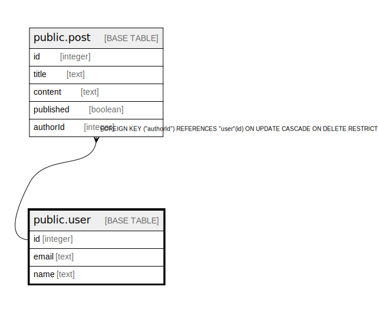

# public.User

## Description

## Columns

| Name  | Type    | Default                            | Nullable | Children                      | Parents | Comment |
| ----- | ------- | ---------------------------------- | -------- | ----------------------------- | ------- | ------- |
| id    | integer | nextval('"User_id_seq"'::regclass) | false    | [public.Post](public.Post.md) |         |         |
| email | text    |                                    | false    |                               |         |         |
| name  | text    |                                    | true     |                               |         |         |

## Constraints

| Name      | Type        | Definition       |
| --------- | ----------- | ---------------- |
| User_pkey | PRIMARY KEY | PRIMARY KEY (id) |

## Indexes

| Name           | Definition                                                                |
| -------------- | ------------------------------------------------------------------------- |
| User_pkey      | CREATE UNIQUE INDEX "User_pkey" ON public."User" USING btree (id)         |
| User_email_key | CREATE UNIQUE INDEX "User_email_key" ON public."User" USING btree (email) |

## Relations

---

> Generated by [tbls](https://github.com/k1LoW/tbls)
