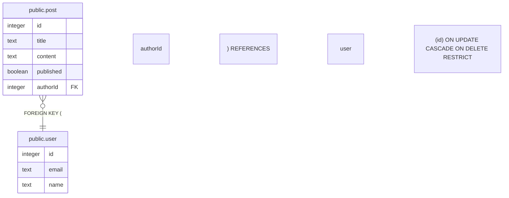

# public.user

## Description

## Columns

| Name | Type | Default | Nullable | Children | Parents | Comment |
| ---- | ---- | ------- | -------- | -------- | ------- | ------- |
| id | integer | nextval('user_id_seq'::regclass) | false | [public.post](public.post.md) |  |  |
| email | text |  | false |  |  |  |
| name | text |  | true |  |  |  |

## Constraints

| Name | Type | Definition |
| ---- | ---- | ---------- |
| user_email_not_null | n | NOT NULL email |
| user_id_not_null | n | NOT NULL id |
| user_pkey | PRIMARY KEY | PRIMARY KEY (id) |

## Indexes

| Name | Definition |
| ---- | ---------- |
| user_pkey | CREATE UNIQUE INDEX user_pkey ON public."user" USING btree (id) |
| user_email_key | CREATE UNIQUE INDEX user_email_key ON public."user" USING btree (email) |

## Relations

---

> Generated by [tbls](https://github.com/k1LoW/tbls)
